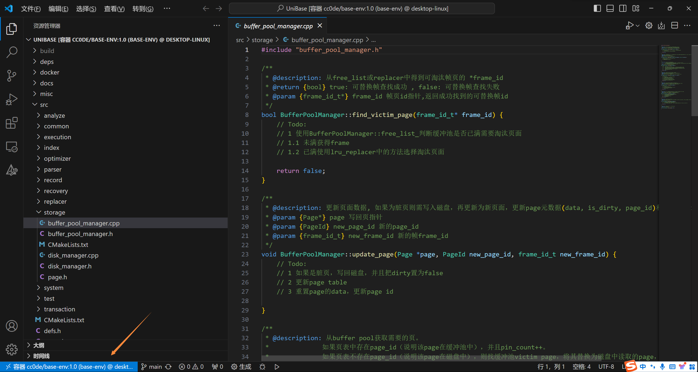

# 如何将VSCode连接到Docker容器
实际上，由于容器内文件和本地磁盘文件的挂载关系，也可以直接在VSCode中找到`UniBase`项目对应的本地文件并编辑它们，然而**本地的开发环境并不一定完全支持这个项目**，且如此一来我们搭建的Docker容器就完全没派上用场了。容器提供了项目**必需的齐全的环境配置和相对安全独立的工作区域**，因此我们最好**远程连接到Docker容器**并在容器中访问和编辑这些文件。
## 准备工作
1. 打开Docker Desktop，进入已经建好的容器`base-env`的页面，点击**启动**该容器。

   

2. 如果你的VSCode还没有安装中文扩展，建议安装以方便对照查看之后的步骤。
   
   

3. 在VSCode侧边栏目中点击查看扩展，在搜索栏中输入`dev containers`搜索该扩展。如果还没有安装该扩展，请点击安装。

   

## 开启连接
4. 确认插件安装完成后，VSCode**左下方**的蓝色方块（如果你正在使用VSCode主题插件，它**可能是其它颜色**），并在**正上方**弹出的下拉列表中，选择“**附加到正在运行的容器**”。
   
   

   

5. 等待片刻，下拉列表中将弹出目前正在运行的容器名称`base-env`，点击即可使VSCode连接到该容器。

   

6. 点击后，VSCode弹出一个**新窗口**，加载后显示出欢迎页面，与此同时，左下角蓝色方块显示出容器的具体名称。此时，**你已经通过VSCode进入该容器**。现在，你可以通过VSCode来访问其中的文件，正如在Windows本地系统上所做的那样。
   
   

7. VSCode侧边栏上的**资源管理器**提示您已经连接到远程。点击提示下方的“**打开文件夹**”按钮，**正上方**将出现显示文件目录的下拉列表。在列表中定位到您在容器中建立的放置`UniBase`项目的文件夹，点击**确定**打开该文件夹作为您的工作区。（如果您之前按照`UniBase`官方教学文档建立的您的容器并克隆`UniBase`项目，那么这个文件夹的路径一般会是“**`/mnt/UniBase`**”。也可以直接在最上方的**输入框**中输入该路径来到定位到该文件夹。）
   >对于“**远程连接**”这种说法，我的粗略理解是，从逻辑上可以把目前所在的容器视为某个角落的一台和这台设备远程连接的某台Linux系统的电脑（尽管它就建立在电脑本地，且和本地磁盘共享一部分储存），这也是上述操作在VSCode中被称为**远程连接**的原因。

   

   

   

   

8. 打开文件夹后，VSCode加载并在侧边栏的**资源管理器**中显示出该文件夹下的所有文件，此时就可以通过VSCode对它们进行移动，复制，编辑等操作了。打开其中任意的项目代码，**开启你的探索之旅吧！**

   

   

## 退出连接
9.  如果想重新访问Windows系统中的文件，请再次点击**左下角**的远程连接按钮，在**正上方**弹出的下拉列表中，选择“**关闭远程连接**”，即可返回到在Windows系统下的工作区。

    

    